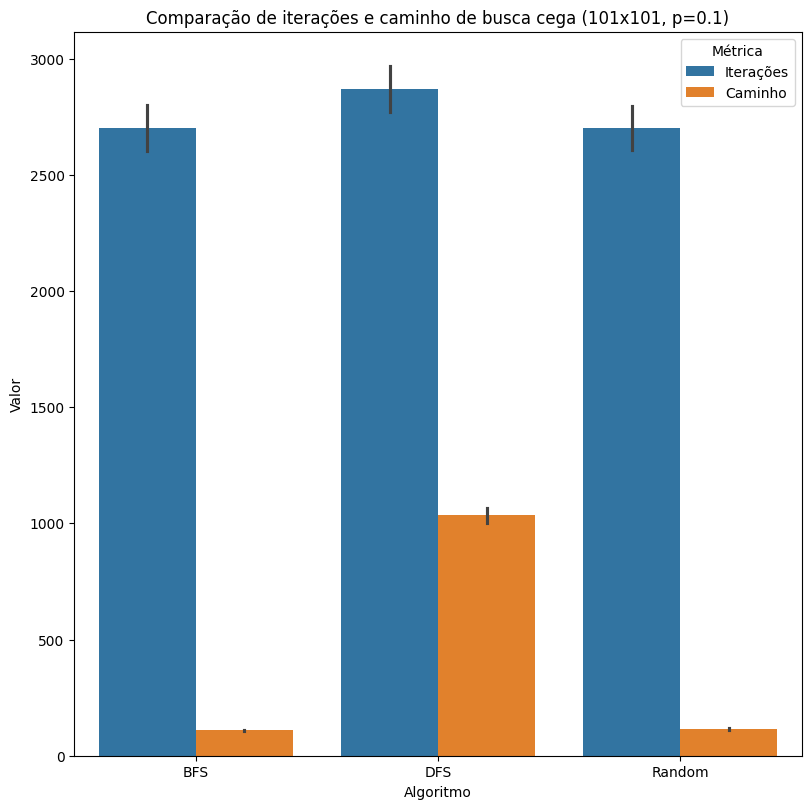
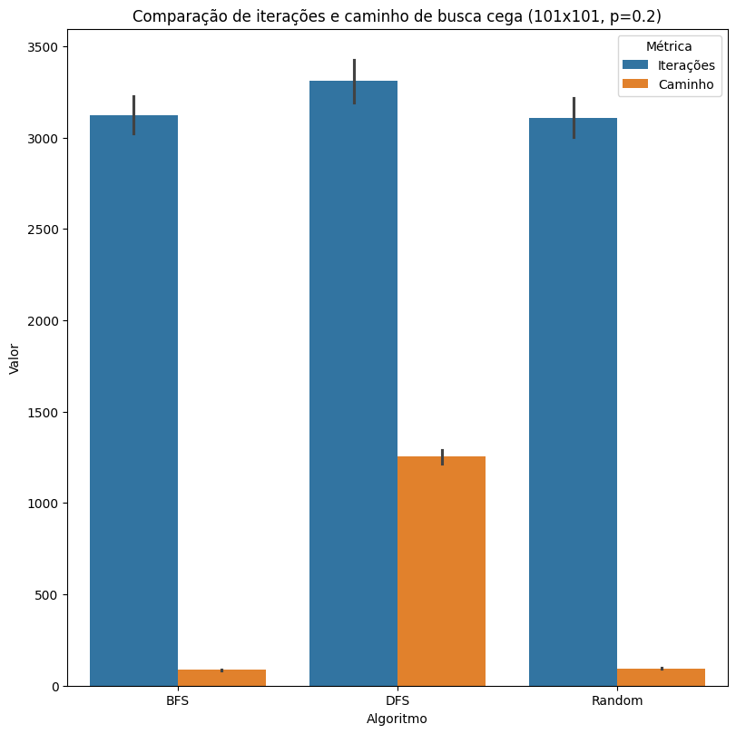
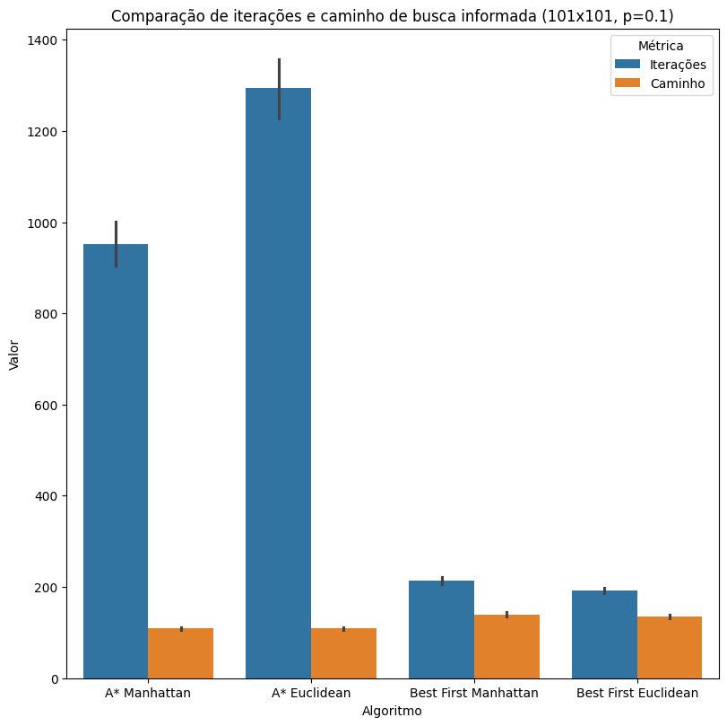
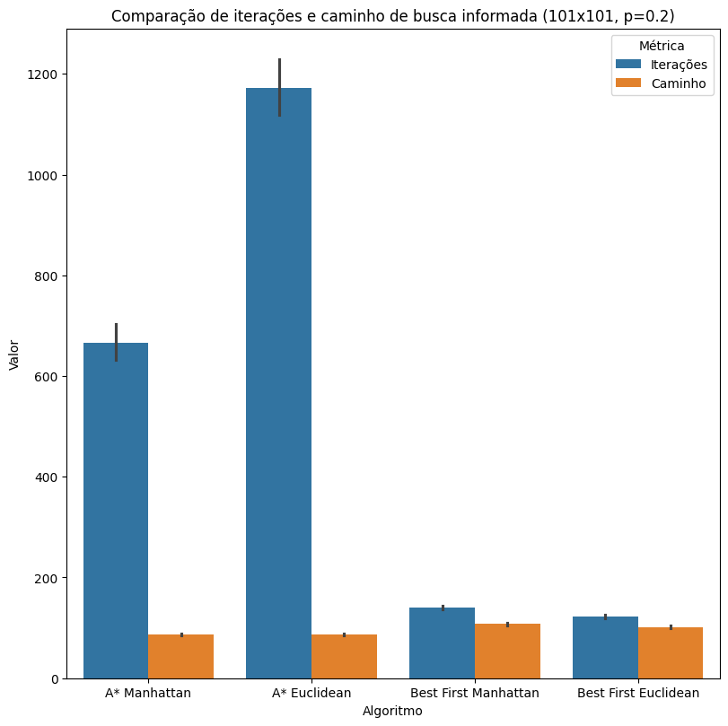
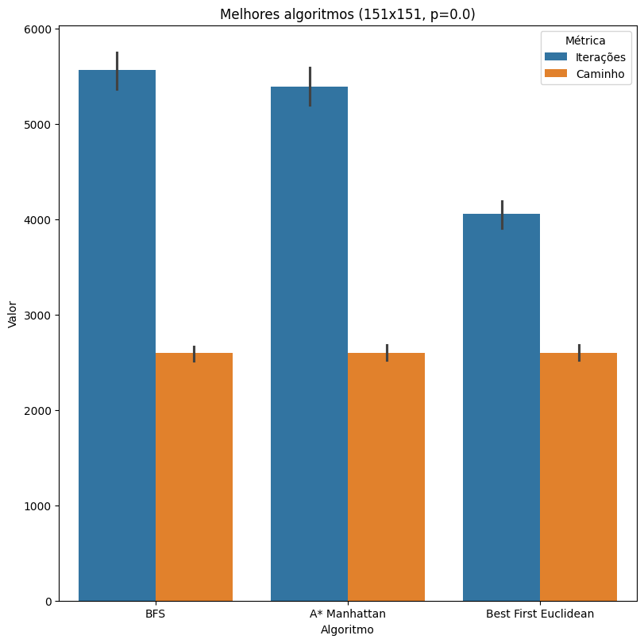
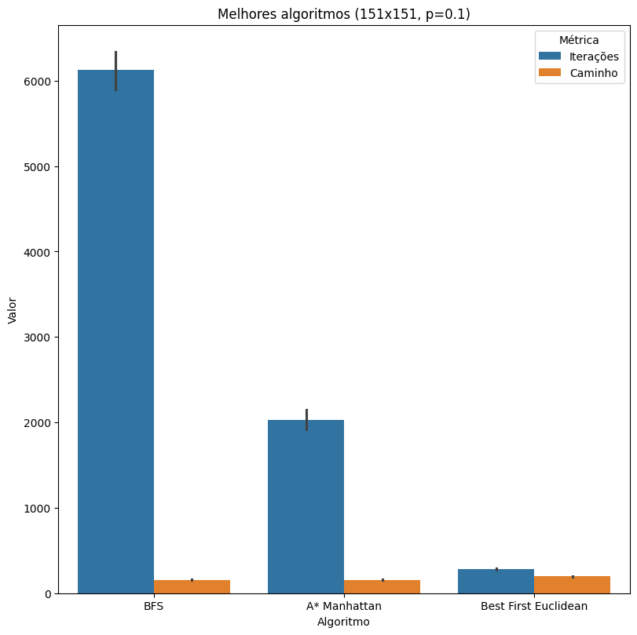
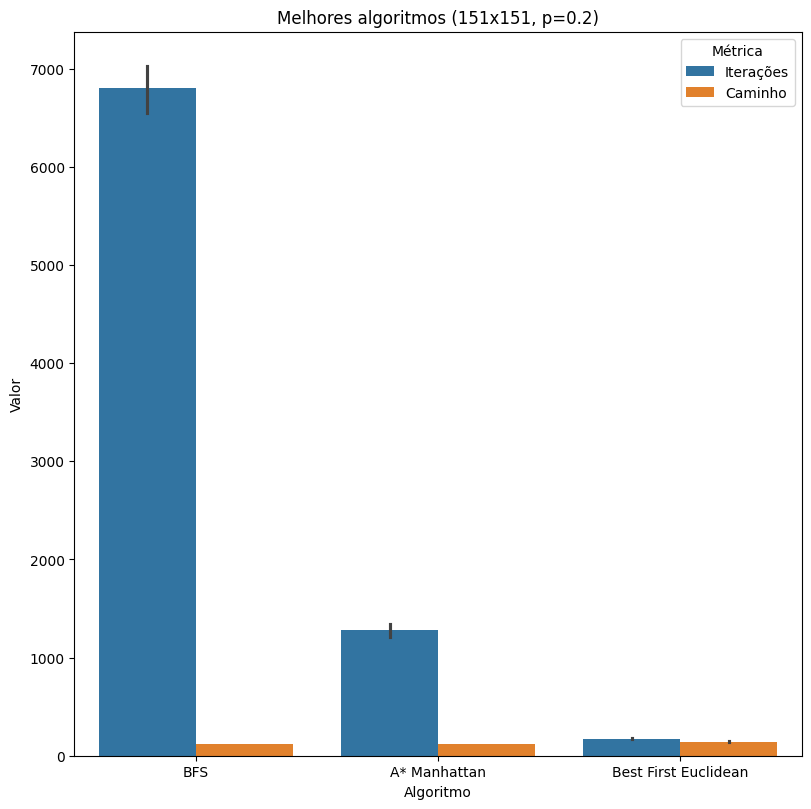

## Introdução

Neste projeto iremos analisar a aplicação de diferentes algoritmos de busca para a resolução de labirintos, comparando algoritmos de busca cega e informada e
as situações onde se destacam. Escolhemos esse clássico das buscas em grafos por ser um bom caminho para visualizar graficamente as características de cada 
algoritmo de busca, além de ser um problema que pode ser facilmente adaptado para diferentes situações, como a busca de caminhos em mapas, a busca de soluções
para quebra-cabeças, entre outros.

## Metodologia

Para este projeto, adotamos a linguagem de programação Python, por ser uma linguagem já familiar aos integrantes do grupo. Nela, implementamos os algoritmos de
busca cega e informada, além de utilidades para representação e manipulação dos labirintos. Além disso, também foram implementados geradores de labirintos aleatórios,
para que pudéssemos testar os algoritmos em diferentes situações e conseguir realizar as análises em volumes maiores de dados.

Outro aspecto importante era a visualização dos labirintos e dos algoritmos de busca. Para isso, decidimos implementar uma pequena aplicação web capaz de representar
os labirintos e animar as buscas de maneira iterativa, fazendo uso do modelo cliente-servidor para que nossa aplicação pudesse consumir os dados gerados pelos algoritmos
implementados em Python. Esta aplicação está disponível no repositório do projeto (<https://github.com/DanielHLelis/maze-solver>), e pode ser acessada através do link: <https://maze.usp.lelis.dev>.

## Os Labirintos

Optamos por representar os labirintos por meio da estrutura de matrizes de booleanos, onde cada célula da matriz representa um ponto do labirinto, e o valor booleano
indicava se aquele ponto era um obstáculo ou não. Contra-intuitivamente, seguimos pelo uso de `True` como indicador de caminho livre, e `False` como indicador de uma
parede, por conta da facilidade de se trabalhar com o tipo `bool` em Python.

Para gerar os labirintos, uma representação alternativa mostrou-se mais conveniente, por simplificar a geração de labirintos aleatórios conectados: a representação
de células e paredes. Nesta representação, cada célula do labirinto é representada por um ponto, e cada parede é representada por um segmento de reta que bloqueia
o caminho entre duas células adjecentes. Esta representação é mais conveniente para a geração de labirintos aleatórios, pois permite que sejam gerados labirintos
conectados, sem a necessidade de se realizar uma busca de conectividade após a geração do labirinto.

Os seguintes algoritmos foram implementados para a geração de labirintos aleatórios: o algoritmos da DFS aleatória, onde é feita uma DFS a partir de uma célula inicial
aleatória, e as paredes são removidas conforme a DFS avança em direções aleatórias; o algoritmo da DFS aleatória com remoções aleatórias (carinhosamente apelidado de 
"DFS do Caos"), onde paredes são removidas aleatoriamente, resultando em um labirinto com loops e múltiplos caminhos possíveis para um mesmo destinho. Por fim, também,
implementamos o algoritmo de Wilson, que gera labirintos aleatórios conectados, sem a necessidade de se realizar uma busca de conectividade após a geração do labirinto.

## Algoritmos de Busca

Os algoritmos de busca foram implementados em cima da estrutura matricial dos labirintos, fazendo a busca em cima do grafo implicitamente representado pela matriz. A seguir
descreveremos brevemente os principais algoritmos implementados e, na sequência, faremos uma análise comparativa entre eles. Para todos os casos, fizemos a análise em cima dos mesmos 1000 labirintos gerados a partir do algoritmo de geração DFS com deleções aleatórias, por conta de sua versatilidade. Além disso,
optamos por não incluir os gráficos dos labirintos com $p=0$, por se tratarem de labirintos fechados com apenas um caminho possível, minimizando a diferença entre os algoritmos e distanciando-os de situações mais realistas.

### Busca Cega

Para a busca cega, implementamos os algoritmos de busca em largura, busca em profundidade e caminhada aleatória. Todos estes algoritmos foram implementados de maneira iterativa. Para não extendermos demais este relatório, não entraremos em detalhes sobre a implementação de cada um deles, mas o código está disponível no repositório do projeto, mais especificamente nos caminhos: `core/maze/bfs_solve.py`, `core/maze/dfs_solve.py`
e `core/maze/rnd_solve.py`.

Os algoritmos de busca cega comportaram-se de maneira esperada, com a busca em largura encontrando o caminho mais curto, e a busca em profundidade encontrando um caminho bem mais longo do que o mínimo e superando o número de iterações dos demais. A caminhada aleatória encontrou um caminho próximo ao mínimo, porém com um
número de iterações tão próximo ao da BFS é difícil justificar seu uso.

### Busca Informada

Para a busca informada, implementamos os algoritmos *Best-First*, A* e DFS com Heurística, todos os três
em duas versões diferentes: uma usando a distância euclidiana como heurística, e outra usando a distância
de Manhattan. Novamente, estes se encontram disponíveis no repositório do projeto, nos caminhos: `core/maze/bfirst_solve.py`, `core/maze/astar_solve.py` e `core/maze/dfs_solve.py`. Nos gráficos a seguir optamos por não incluir a DFS com heurística, pois ela não se diferenciou o suficiente da DFS cega para justificar sua inclusão, talvez alguns refinamentos adicionais na heurística junto a outras estratégias de poda possam
melhorar seu desempenho.

Aqui encontramos alguns resultados bem interessantes: o primeiro é que a heurística de Manhattan se comportou
melhor no A*, o que era de certa forma esperado por ser uma heurística mais precisa para o problema, porém, no
Best-First, a heurística euclidiana se saiu melhor. Outro resultado interessante é o quão bem o Best-First se
saiu, encontrando caminhos muito próximos ao mínimo, porém com um número de iterações muito menor que o A*.

## Comparações finais e conclusões

A partir dos apontamentos anteriores, iremos comparar os melhores algoritmos de cada nicho de aplicação a seguir:

Ao longo do projeto, conseguimos observar as características de cada algoritmo de busca e as situações onde cada um deles se destaca. A busca em largura se mostrou relativamente eficiente para encontrar o caminho mais
curto, porém o A* sempre se saiu melhor no número de iterações. Porém é necessário tomar cuidado, pois ainda
assim nem sempre será mais eficiente utilizar o A*, pois o cálculo da heurística pode ser custoso, mostrando-se
mais benéfico a adoção do A* em labirintos maiores, onde a redução no número de iterações compensa o custo
computacional da heurística. O Best-First, por sua vez, se mostrou a melhor alternativa quando uma solução próxima o suficiente do mínimo é suficiente, pois ele se mostrou muito eficiente em encontrar caminhos próximos ao mínimo, porém com um número de iterações muito menor que o A*. Isso pode tornar o Best-First uma boa alternativa para labirintos gigantes, onde o A* pode se tornar inviável por conta do custo computacional.

Além disso, o desenvolvimento de ferramentas para visualizar os algoritmos mostrou-se bastante interessante
para explorar os algoritmos e entender seus comportamentos em diferentes tipos de labirintos.

## Referências

- [Maze generation algorithm](https://en.wikipedia.org/wiki/Maze_generation_algorithm)
